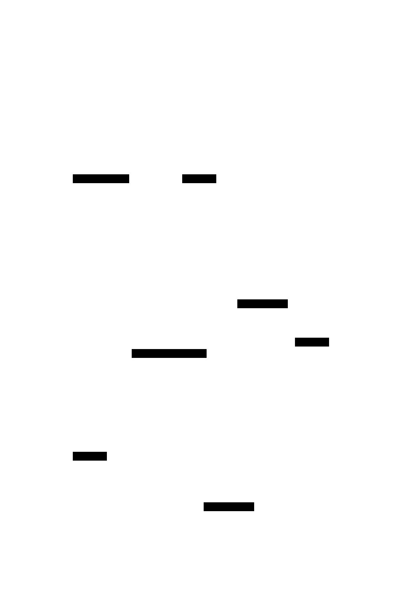

# Vim キーバインドシステム

## 概要

folio は Vim ライクなキー操作を実装しています。`useVimKeys` フックがキーイベントを処理し、`VimAction` を発火させます。アクションは `useFileOps` フックで実際の処理に変換されます。

## Vim モード

3 つのモードがあり、モードによってキーイベントの処理が変わります。


| モード | 説明 |
|---|---|
| `NORMAL` | 通常操作モード。すべての Vim キーバインドが有効 |
| `SEARCH` | インクリメンタルサーチモード。`/` キーで移行 |
| `COMMAND` | コマンドパレットモード。`:` キーで移行 |

`SEARCH` / `COMMAND` モード中は `useVimKeys` が `vimMode !== 'NORMAL'` を検知してキーハンドラを登録しません。代わりに各モーダルコンポーネントが独自にキーイベントを処理します。

## キーシーケンス処理

`gg`・`dd`・`yy`・`sn` など複数キーの組み合わせは、バッファリングによって実現しています。



### 処理の詳細

1. `window` に `keydown` イベントリスナーを登録（`useEffect` 内）
2. `INPUT` / `TEXTAREA` へのイベントは無視する
3. 修飾キー付きショートカット（`Cmd+C`・`Ctrl+L` など）は専用ハンドラで即時処理
4. 通常キーはバッファに追加し、キーマップと照合する
5. **完全一致**: アクションを発火してバッファをクリア
6. **プレフィックス一致**: 500ms のタイムアウトをセットして次のキー入力を待つ
7. **一致なし**: バッファをクリア（コマンドをキャンセル）
8. `Escape` は常にバッファをクリア

タイムアウト（500ms）は `SEQUENCE_TIMEOUT` 定数で定義されています（`src/hooks/useVimKeys.ts`）。

### 修飾キーショートカット

Vim キーマップとは別に、macOS 標準のショートカットも処理します。

| ショートカット | アクション |
|---|---|
| `Cmd+C` | yank（コピー） |
| `Cmd+X` | cut（カット） |
| `Cmd+V` | paste（ペースト） |
| `Cmd+Delete` | delete（ゴミ箱へ移動） |
| `Cmd+W` | close_tab（タブを閉じる） |
| `Ctrl+L` | focus_path_bar（パスバーにフォーカス） |
| `←（ArrowLeft）` | navigate_up（親ディレクトリへ移動） |

## キーマップ定義

キーマップは `src/lib/vim/keymap.ts` の `NORMAL_KEYMAP` として定義されています。

各エントリは `{ keys: string[], action: VimAction }` の形式で、`keys` はシーケンス内のキー名の配列です。

```ts
{ keys: ['g', 'g'], action: 'cursor_first' }   // gg → 先頭へ
{ keys: ['y', 'y'], action: 'yank_selected' }   // yy → コピー
{ keys: ['s', 'n'], action: 'sort_name' }        // sn → 名前ソート
```

### カスタマイズ

`config.toml` の `[keymap]` セクションでアクションごとにキーシーケンスをオーバーライドできます。

```toml
[keymap]
cursor_down = ["j", "n"]   # j と n の両方をカーソル下に割り当て
```

設定は `configStore.buildKeymap()` でデフォルトキーマップにマージされます。オーバーライドするアクションのデフォルトバインドは除去されてから、新しいバインドが追加されます。

## アクションから処理への変換

`useVimKeys` が発火した `VimAction` は `App.tsx` の `handleAction` 関数で受け取り、`useFileOps` の各ハンドラや `tabStore`・`uiStore` のメソッドに振り分けます。

```
VimAction 発火
  → App.tsx handleAction()
    → useFileOps.handleDelete() など   ← ファイル操作
    → tabStore.nextTab() など          ← タブ操作
    → uiStore.toggleSidebar() など     ← UI 操作
```

## VimAction 一覧

| カテゴリ | アクション |
|---|---|
| カーソル移動 | `cursor_up` `cursor_down` `cursor_first` `cursor_last` |
| ナビゲーション | `navigate_up` `navigate_into` `go_back` `go_forward` |
| ファイル操作 | `delete_selected` `cut_selected` `yank_selected` `paste` `rename` `new_dir` `new_file` `reload` |
| クリップボード | `copy_path` `copy_name` `toggle_select` |
| 開く | `open_selected` `open_terminal` `open_terminal_here` `open_with_app` `open_editor` |
| タブ | `new_tab` `close_tab` `next_tab` `prev_tab` |
| ソート | `sort_name` `sort_name_desc` `sort_time` `sort_time_desc` `sort_reverse` |
| UI | `toggle_sidebar` `toggle_hidden` `toggle_preview` `show_help` |
| 検索・移動 | `enter_search` `enter_command` `focus_path_bar` `focus_zoxide` |
| ブックマーク | `add_bookmark` `open_bookmark_picker` |
